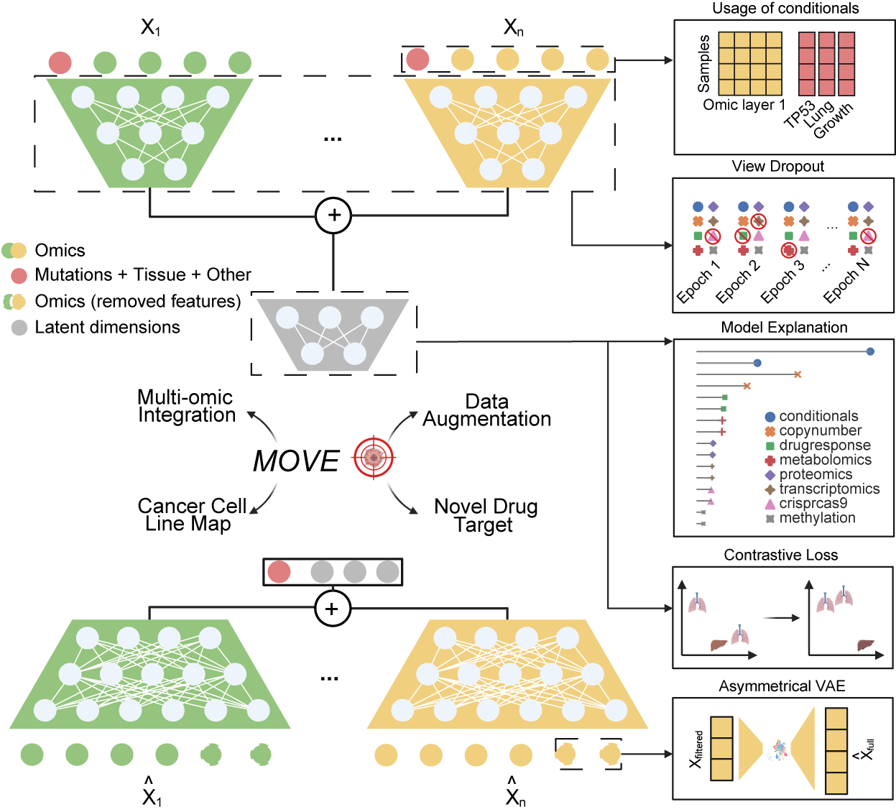

# MOVE - Multi-omics Variational Autoencoder

This repository presents a bespoke Variational Autoencoder (VAE) that integrates all molecular and phenotypic data sets available for cancer cell lines.

## Installation

1. Clone this repository
2. Create a python (Python 3.10) environment: e.g. `conda create -n mosa python=3.10`
3. Activate the python environment: `conda activate mosa`
4. Run `pip install -r requirements.txt`
5. Run `pip install torch==2.2.1 torchvision==0.17.1 torchaudio==2.2.1 --index-url https://download.pytorch.org/whl/cu118`
6. Download data files from figshare repository (see links in the manuscript)

## Usage

1. Configure the paths of the data files in `reports/vae/files/hyperparameters.json`
2. Run MOVE with `python PhenPred/vae/Main.py`

## Citation
Cai, Z et al., Synthetic multi-omics augmentation of cancer cell lines using unsupervised deep learning, 2023

