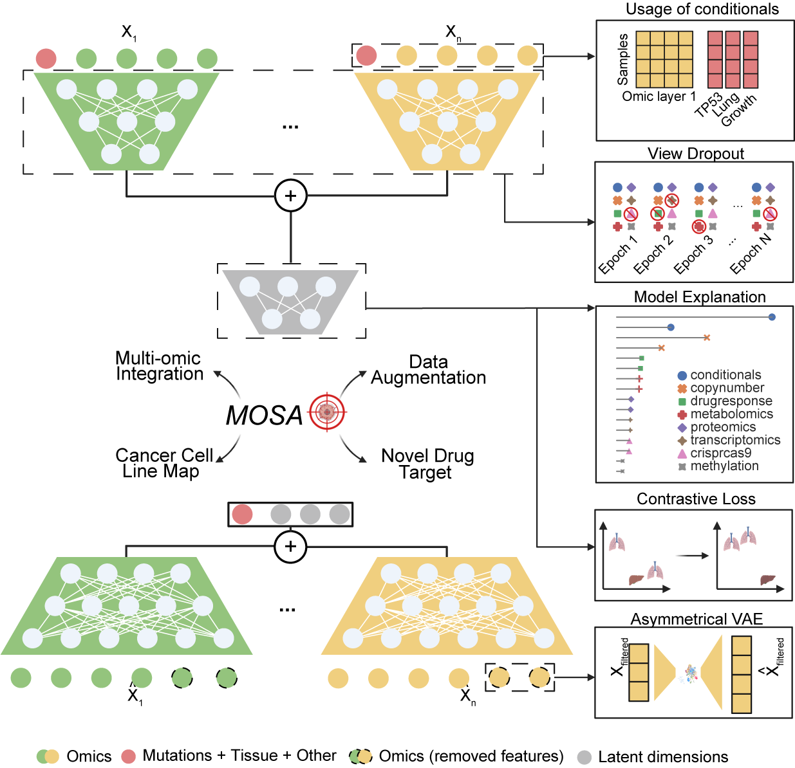

# MOSA - Multi-omic Synthetic Augmentation

This repository presents a bespoke Variational Autoencoder (VAE) that integrates all molecular and phenotypic data sets available for cancer cell lines.

## Installation
### Instruction
1. Clone this repository
2. Create a python (Python 3.10) environment: e.g. `conda create -n mosa python=3.10`
3. Activate the python environment: `conda activate mosa`
4. Run `pip install -r requirements.txt`
5. Install shap from `https://github.com/ZhaoxiangSimonCai/shap`, which is customised to support the data format in MOSA.
5. Run `pip install torch==2.2.1 torchvision==0.17.1 torchaudio==2.2.1 --index-url https://download.pytorch.org/whl/cu118`

### Typical installation time
The installation time largely depends on the internet speed as packages need to be downloaded and installed over the internet. Typically the installation should take less than 10 minutes.

## Demo
### Instruction
1. Download data files from figshare repository (see links in the manuscript)
2. Configure the paths of the data files in `reports/vae/files/hyperparameters.json`
3. Run MOSA with `python PhenPred/vae/Main.py`
### Expected output
The expected output, including the latent space matrix and reconstructed data matrices, can be downloaded from the figshare repository as described in the paper.
### Expected runtime
As a deep learning-based method, the runtime of MOSA depends on whether a GPU is available for training. MOSA took 52 minutes to train and generate the results using a V100 GPU on the DepMap dataset.

## Instructions for using MOFA with custom data
Although MOSA is specifically designed for analysing the DepMap dataset, the model can be  adapted for any multi-omic datasets. To use MOSA with custom datasets:
1. Prepare the custom dataset following the formats of DepMap data, which can be downloaded from figshare repositories as described in the manuscript.
2. Configure the paths of the data files in `reports/vae/files/hyperparameters.json`. At least two omic datasets are required.
3. Run MOSA with `python PhenPred/vae/Main.py`
4. If certain benchmark analysis cannot be run properly, MOSA can be run by setting `skip_benchmarks=true` in the  `hyperparameters.json` to only save the output data, which includes the integrated latent space matrix and reconstructed data for each omics.
5. To further customise data pre-processing, the user can create their own dataset following the style of `PhenPred/vae/DatasetDepMap23Q2.py`, and the use the custome dataset class in the `Main.py`.

## Reproduction instructions
### To reproduce the benchmark results
1. Download the data from [figshare](https://doi.org/10.6084/m9.figshare.24562765)
2. Place the downloaded files to `reports/vae/files/` 
3. In the `Main.py`, configure to run MOSA from pre-computed data ` hyperparameters = Hypers.read_hyperparameters(timestamp="20231023_092657")`.

### To reproduce from scratch
1. Directly run MOSA with the default configurations as described above.

## Citation
Cai, Z et al., Synthetic multi-omics augmentation of cancer cell lines using unsupervised deep learning, 2023

